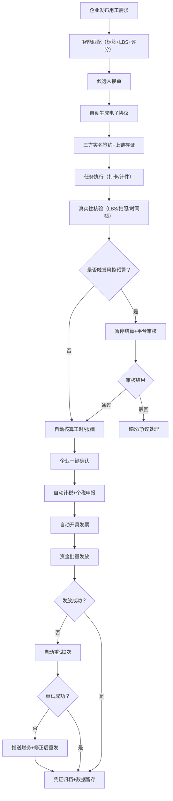

## 1. 产品概述

人力资源灵活用工与薪税合规结算平台，面向企业、灵活就业人员、财务、平台运营、税务监管多方主体，实现用工发布、智能匹配、电子签约、任务履约、工时确认、自动结算、薪税合规、风控预警、数据监管一体化闭环。平台以真实业务、真实履约、真实报税为底线，严格遵循国家灵活用工、个税代征、发票管理、资金结算相关法规。

- **主要目的**：解决灵活用工场景下的合规性难题，实现全流程数字化管理
- **目标用户**：企业HR、企业财务、灵活就业人员、平台管理员、税务监管
- **市场价值**：为企业降本增效，为灵活就业者提供合规保障，为监管提供透明数据

## 2. 核心功能

### 2.1 用户角色

| 角色 | 注册方式 | 核心权限 |
|------|----------|----------|
| 灵活用工者 | 手机号+实名认证 | 接单、打卡、协议查看、报酬查询、提现记录 |
| 企业HR | 企业认证注册 | 发布需求、人员管理、任务验收、工时确认、风险查看 |
| 企业财务 | 企业认证注册 | 费用确认、发放查看、发票管理、对账、完税凭证 |
| 平台管理员 | 平台分配 | 企业审核、风控处理、争议处理、大屏监管、系统配置、权限分配 |

### 2.2 功能模块

1. **登录首页**：角色选择登录、系统概览、快捷入口
2. **用工发布与智能匹配**：需求发布表单、标签匹配、候选人推荐列表、双向选择
3. **电子签约中心**：协议模板、三方签约、区块链存证、验签查询
4. **任务履约管理**：任务看板、LBS打卡、计件提交、验收流程、工时统计
5. **薪税结算中心**：自动核算、个税计算、批量发放、发放记录、失败重试
6. **发票与完税凭证**：发票开具、发票列表、完税凭证、对账凭证导出
7. **风控预警中心**：三级预警、异常检测、风控拦截、审核处理
8. **争议处理中心**：争议申请、证据调取、平台仲裁、闭环记录
9. **合规监管大屏**：实时指标、多维度筛选、可视化图表、数据钻取
10. **企业合规看板**：在用人数、成本分析、合规报告、台账导出
11. **个人中心**：个人信息、实名认证、协议管理、收入明细

### 2.3 页面详情

| 页面名称 | 模块名称 | 功能描述 |
|---------|---------|----------|
| 登录首页 | 角色选择面板 | 四种角色切换登录、记住账号、忘记密码 |
| 登录首页 | 系统概览仪表盘 | 根据角色展示不同概览卡片、待办事项、快捷入口 |
| 用工发布页面 | 需求发布表单 | 用工类型、服务内容、工期、结算标准、工作地点、技能标签、验收标准 |
| 用工发布页面 | 智能匹配结果 | 技能匹配度、距离范围、历史评分、接单率、综合评分排序 |
| 电子签约页面 | 协议模板展示 | 服务内容、工时规则、报酬标准、验收规则、违约责任、个税条款 |
| 电子签约页面 | 三方签约流程 | 企业确认→个人确认→平台确认→电子签名→上链存证 |
| 任务履约页面 | 任务看板 | 进行中/待验收/已完成/异常状态分类 |
| 任务履约页面 | LBS打卡模块 | 上下班打卡、地点校验、时间戳记录、拍照上传 |
| 任务履约页面 | 计件提交模块 | 成果物上传、数量填写、验收标准对照 |
| 薪税结算页面 | 结算明细列表 | 有效工时/完成量、单价、应付、扣款、奖励、个税、实发 |
| 薪税结算页面 | 批量发放中心 | 发放批次、发放状态、进度条、失败重试、发放记录导出 |
| 发票管理页面 | 发票开具列表 | 发票号码、开票项目、金额、开票日期、下载PDF |
| 风控预警页面 | 预警列表 | 异常类型、风险等级、涉及人员/任务、处理状态 |
| 风控预警页面 | 风控审核面板 | 证据展示、审核意见、通过/驳回/转人工 |
| 争议处理页面 | 争议工单列表 | 发起方、争议类型、状态、创建时间、处理结果 |
| 监管大屏页面 | 实时指标卡片 | 活跃人数、累计结算、代征个税、发票金额、预警数、成功率 |
| 监管大屏页面 | 可视化图表 | 趋势折线图、分布饼图、地区热力图、柱状对比图 |
| 企业看板页面 | 成本合规报告 | 月度成本、同比环比、合规评分、风险点提示 |
| 个人中心 | 收入明细 | 月度收入、已发/待发、个税明细、提现记录 |

## 3. 核心流程

### 3.1 用工发布到结算全流程

企业发布用工需求 → 系统标签+LBS智能匹配 → 候选人接单 → 自动生成电子协议 → 三方实名签约上链 → 任务执行（打卡/计件） → 系统自动核验（LBS/拍照/OCR） → 工时/完成量自动核算 → 企业一键确认 → 系统自动计税 → 对接税务平台申报 → 自动开具发票 → 资金批量发放 → 发放成功/失败重试 → 凭证归档留存

### 3.2 风控预警处理流程

异常触发（LBS异常/虚假定位/重复图片/集中大额） → 系统自动预警（三级分级） → 自动暂停结算 → 平台审核员介入 → 调取证据（协议/打卡/照片/验收） → 审核判定（正常/驳回/整改） → 恢复结算或闭环处理 → 风控日志永久留存

### 3.3 薪资发放失败闭环

发放申请 → 账户校验（姓名/卡号/余额） → 代付通道发起 → 发放成功/失败 → 失败自动重试2次（间隔30分钟） → 仍失败则暂停推送财务 → 信息修正后重新发起 → 资金流水全程留痕

## 4. 用户界面设计

### 4.1 设计风格

- **主色调**：深蓝 #1e3a5f（专业、信任、合规）
- **辅助色**：翠绿 #059669（通过、成功、合规）、橙红 #dc2626（警告、风险）、琥珀 #d97706（待处理、预警）
- **中性色**：锌灰系列（zinc-50 到 zinc-900）
- **按钮风格**：圆角 8px，悬停阴影过渡 0.2s，主按钮深蓝渐变
- **字体**：标题用 "Noto Serif SC"（庄重感），正文用 "Noto Sans SC"（清晰易读）
- **布局风格**：左侧导航栏 + 顶部状态栏 + 主内容区卡片式布局
- **图标风格**：Lucide React 线性图标，统一尺寸 18/20px

### 4.2 页面设计概览

| 页面名称 | 模块名称 | UI元素 |
|---------|---------|--------|
| 登录首页 | 角色选择面板 | 4张角色卡片（图标+标题+描述），选中态深蓝色边框，点击动画 |
| 登录首页 | 登录表单 | 毛玻璃效果背景，输入框带图标，渐变提交按钮 |
| 监管大屏 | 顶部指标栏 | 6个大数字卡片，渐变色块+图标，数字滚动动画 |
| 监管大屏 | 图表区域 | 4象限布局（趋势图/分布图/对比图/热力图），ECharts图表 |
| 结算中心 | 数据表格 | 斑马纹行，悬停高亮，状态标签带颜色圆点 |
| 结算中心 | 操作工具栏 | 筛选器组合、搜索框、批量操作按钮、导出下拉菜单 |
| 风控预警 | 预警卡片 | 风险等级色条（红/橙/黄），时间线式处理记录 |
| 电子签约 | 协议预览 | 仿真合同样式，骑缝章效果，签名区域高亮 |
| 任务履约 | 打卡界面 | 大圆形打卡按钮，GPS定位状态指示，拍照上传缩略图 |

### 4.3 响应式设计

- **设计原则**：Desktop-first，移动自适应
- **断点策略**：1440px（大屏优化）、1280px（标准桌面）、1024px（平板横屏）、768px（平板竖屏）、480px（手机）
- **移动端优化**：侧边栏收起为汉堡菜单、表格转为卡片列表、按钮尺寸增大适配触控
- **触控优化**：最小触控区域 44×44px，重要操作避免边缘误触

### 4.4 动效设计

- **页面加载**：骨架屏 → 数据渐入，导航栏高度 0→64px 展开动画
- **卡片悬停**：轻微上移 2px + 阴影加深
- **数据更新**：数字滚动动画（countUp），高亮闪烁提示
- **状态切换**：标签颜色过渡 0.3s，进度条平滑增长
- **模态弹窗**：背景模糊 + 内容区缩放入场
