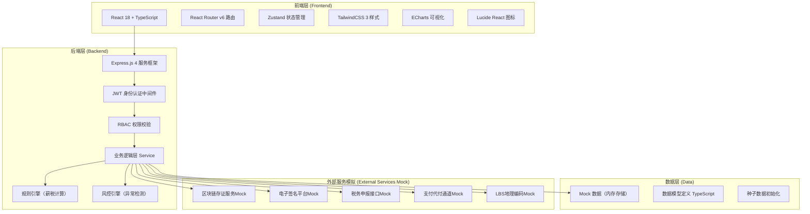
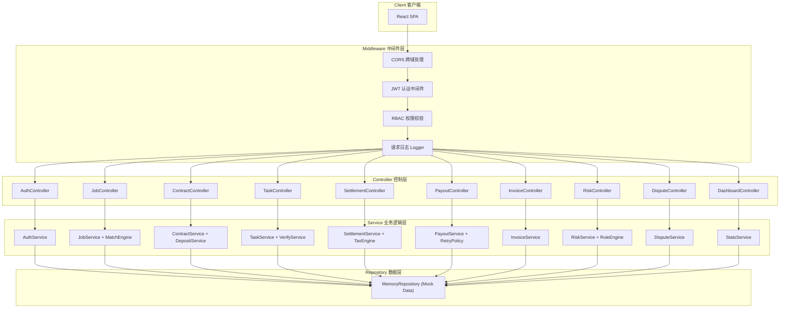
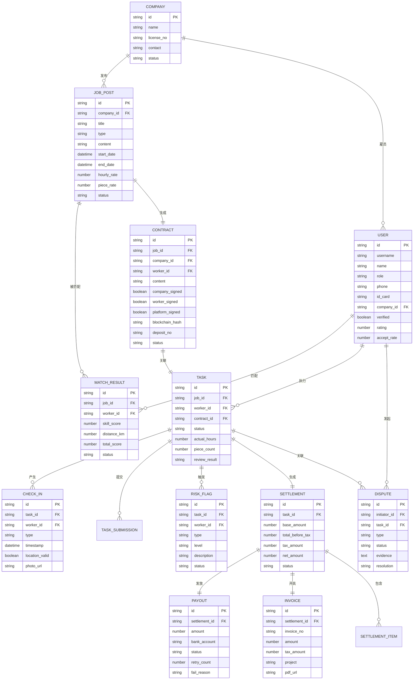

## 1. 架构设计



## 2. 技术说明

- **前端框架**：React@18 + TypeScript@5 + Vite@5
- **路由管理**：react-router-dom@6
- **状态管理**：zustand@4
- **样式方案**：TailwindCSS@3 + PostCSS
- **UI组件**：原生封装组件（无第三方UI库）
- **图表可视化**：echarts@5 + echarts-for-react
- **图标库**：lucide-react@0.400
- **初始化工具**：vite-init（react-express-ts模板）
- **后端框架**：Express@4 + TypeScript
- **数据存储**：内存Mock数据（无需数据库）
- **HTTP客户端**：axios@1

## 3. 路由定义

| 路由路径 | 页面名称 | 适用角色 | 用途说明 |
|---------|---------|---------|---------|
| /login | 登录页 | 全部 | 角色选择+账号密码登录 |
| / | 首页仪表盘 | 全部 | 按角色展示概览+待办+快捷入口 |
| /jobs/publish | 用工发布 | 企业HR | 发布新用工需求表单 |
| /jobs/list | 需求列表 | 企业HR/灵活用工者 | 企业看已发布+匹配结果，个人看可接任务 |
| /jobs/match | 智能匹配 | 企业HR | 匹配候选人列表+综合评分 |
| /contract/list | 协议列表 | 全部 | 查看已签约协议+存证编号 |
| /contract/sign/:id | 签约页面 | 全部 | 协议预览+三方电子签名 |
| /tasks/board | 任务看板 | 企业HR/灵活用工者 | 任务状态分类看板 |
| /tasks/checkin | 打卡页面 | 灵活用工者 | LBS上下班打卡+拍照上传 |
| /tasks/submit | 计件提交 | 灵活用工者 | 成果物上传+完成量提交 |
| /tasks/review | 任务验收 | 企业HR | 验收通过/驳回+评语 |
| /settlement/list | 结算明细 | 全部 | 工时/报酬/个税明细列表 |
| /settlement/payout | 发放中心 | 企业财务/平台 | 批量发放+失败重试+发放记录 |
| /invoice/list | 发票管理 | 企业财务 | 发票列表+开具+下载 |
| /tax/declaration | 税务申报 | 企业财务/平台 | 个税申报数据+完税凭证 |
| /risk/warnings | 风控预警 | 平台管理员 | 预警列表+三级风险展示 |
| /risk/review | 风控审核 | 平台管理员 | 审核面板+证据调取+判定 |
| /dispute/list | 争议处理 | 全部 | 工单列表+申请仲裁+查看结果 |
| /dashboard/monitor | 监管大屏 | 平台管理员 | 实时指标+可视化+多维度筛选 |
| /dashboard/enterprise | 企业看板 | 企业HR/财务 | 成本合规+报告导出+台账 |
| /profile/me | 个人中心 | 全部 | 个人信息+实名认证+收入明细 |

## 4. API 定义

### 4.1 类型定义

```typescript
// 用户角色
type UserRole = 'worker' | 'hr' | 'finance' | 'admin';

// 用户信息
interface User {
  id: string;
  username: string;
  name: string;
  role: UserRole;
  phone: string;
  idCard?: string;
  avatar?: string;
  companyId?: string;
  verified: boolean;
  skills: string[];
  location: { lat: number; lng: number; address: string };
  rating: number;
  acceptRate: number;
}

// 用工需求
interface JobPost {
  id: string;
  companyId: string;
  title: string;
  type: 'hourly' | 'piecework';
  content: string;
  startDate: string;
  endDate: string;
  hourlyRate?: number;
  pieceRate?: number;
  workLocation: { lat: number; lng: number; address: string; radius: number };
  skills: string[];
  requirements: string;
  acceptanceCriteria: string;
  status: 'draft' | 'published' | 'matched' | 'in_progress' | 'completed';
  createdAt: string;
}

// 智能匹配结果
interface MatchResult {
  jobId: string;
  workerId: string;
  worker: User;
  skillMatchScore: number;
  distanceKm: number;
  ratingScore: number;
  acceptRateScore: number;
  totalScore: number;
  status: 'pending' | 'accepted' | 'rejected';
}

// 电子协议
interface Contract {
  id: string;
  jobId: string;
  companyId: string;
  workerId: string;
  content: string;
  templateVersion: string;
  companySigned: boolean;
  workerSigned: boolean;
  platformSigned: boolean;
  signedAt?: string;
  blockchainHash?: string;
  depositNo?: string;
  status: 'draft' | 'signing' | 'signed' | 'deposited';
}

// 任务打卡
interface CheckIn {
  id: string;
  taskId: string;
  workerId: string;
  type: 'checkin' | 'checkout';
  timestamp: string;
  location: { lat: number; lng: number };
  locationValid: boolean;
  photoUrl?: string;
  photoValid?: boolean;
}

// 任务
interface Task {
  id: string;
  jobId: string;
  workerId: string;
  contractId: string;
  status: 'pending' | 'in_progress' | 'pending_review' | 'completed' | 'abnormal';
  actualHours?: number;
  pieceCount?: number;
  checkIns: CheckIn[];
  submissions?: TaskSubmission[];
  reviewResult?: 'pass' | 'reject';
  reviewComment?: string;
  riskFlags: RiskFlag[];
}

// 计件提交
interface TaskSubmission {
  id: string;
  taskId: string;
  count: number;
  images: string[];
  description: string;
  submittedAt: string;
}

// 结算单
interface Settlement {
  id: string;
  taskId: string;
  workerId: string;
  companyId: string;
  baseAmount: number;
  deductions: SettlementItem[];
  bonuses: SettlementItem[];
  totalBeforeTax: number;
  taxAmount: number;
  netAmount: number;
  taxBracket: string;
  status: 'pending' | 'confirmed' | 'paid' | 'failed';
  confirmedAt?: string;
  paidAt?: string;
}

// 风控标记
interface RiskFlag {
  id: string;
  taskId?: string;
  workerId?: string;
  type: 'location_abnormal' | 'photo_duplicate' | 'suspicious_hours' | 'concentrated_settlement' | 'multi_account';
  level: 'low' | 'medium' | 'high';
  description: string;
  triggeredAt: string;
  status: 'pending' | 'reviewed' | 'cleared';
  reviewerId?: string;
  reviewComment?: string;
}

// 发放记录
interface Payout {
  id: string;
  settlementId: string;
  amount: number;
  bankAccount: string;
  bankName: string;
  accountName: string;
  status: 'pending' | 'processing' | 'success' | 'failed';
  retryCount: number;
  failReason?: string;
  paidAt?: string;
 流水号?: string;
}

// 发票
interface Invoice {
  id: string;
  settlementId: string;
  invoiceNo: string;
  amount: number;
  taxAmount: number;
  project: string;
  issuedAt: string;
  pdfUrl: string;
}
```

### 4.2 接口列表

| Method | Path | 说明 |
|--------|------|------|
| POST | /api/auth/login | 登录认证，返回JWT Token |
| GET | /api/auth/profile | 获取当前用户信息 |
| POST | /api/jobs | 企业发布用工需求 |
| GET | /api/jobs | 获取用工需求列表 |
| GET | /api/jobs/:id/match | 智能匹配候选人 |
| POST | /api/jobs/:id/apply | 灵活用工者接单 |
| GET | /api/contracts | 获取协议列表 |
| GET | /api/contracts/:id | 获取协议详情 |
| POST | /api/contracts/:id/sign | 签署协议 |
| GET | /api/contracts/:id/verify | 验签+存证查询 |
| GET | /api/tasks | 获取任务列表（支持状态筛选） |
| POST | /api/tasks/:id/checkin | 上下班打卡 |
| POST | /api/tasks/:id/submit | 计件成果提交 |
| POST | /api/tasks/:id/review | 任务验收 |
| GET | /api/settlements | 获取结算列表 |
| POST | /api/settlements/:id/confirm | 企业确认结算 |
| GET | /api/settlements/calculate/:taskId | 预览薪税计算 |
| POST | /api/payouts/batch | 批量发起发放 |
| POST | /api/payouts/:id/retry | 发放失败重试 |
| GET | /api/invoices | 获取发票列表 |
| POST | /api/invoices/:id/download | 下载发票PDF |
| GET | /api/tax/declarations | 获取个税申报数据 |
| GET | /api/risk/warnings | 获取风控预警列表 |
| POST | /api/risk/warnings/:id/review | 风控审核处理 |
| GET | /api/disputes | 获取争议工单列表 |
| POST | /api/disputes | 发起争议申请 |
| POST | /api/disputes/:id/resolve | 平台仲裁处理 |
| GET | /api/dashboard/overview | 获取首页概览数据 |
| GET | /api/dashboard/monitor | 获取监管大屏数据 |
| GET | /api/dashboard/enterprise | 获取企业看板数据 |

## 5. 服务器架构图



## 6. 数据模型

### 6.1 ER 图



### 6.2 核心业务规则引擎

#### 薪税计算规则引擎
```
输入：
  - 税前金额 totalBeforeTax
  - 地区 region
  - 用工类型 type

规则：
  1. 800元以下：个税 = 0
  2. 800-4000元：个税 = (totalBeforeTax - 800) × 20%
  3. 4000-20000元：个税 = totalBeforeTax × (1-20%) × 20%
  4. 20000-50000元：个税 = totalBeforeTax × (1-20%) × 30% - 2000
  5. 50000元以上：个税 = totalBeforeTax × (1-20%) × 40% - 7000

输出：
  - 个税金额 taxAmount
  - 税后净额 netAmount
  - 适用税档 taxBracket
```

#### 智能匹配评分算法
```
总分 = 技能匹配度 × 40% + 距离评分 × 30% + 履约评分 × 20% + 接单率 × 10%

技能匹配度：
  - 完全匹配所有标签：100分
  - 匹配核心标签：80分
  - 部分匹配：60分
  - 不匹配：0分

距离评分（5km内满分）：
  - 0-1km：100分
  - 1-3km：80分
  - 3-5km：60分
  - 5km以上：40分 × (5/distance)

履约评分：历史评分直接映射（满分5星→100分）
接单率：实际接单率×100
```

#### 风控触发规则
```
位置异常：打卡距离 > 任务地点半径 → 触发 location_abnormal (medium)
图片重复：提交图片哈希值已存在 → 触发 photo_duplicate (high)
异常工时：单日工时 > 12小时 或 单周 > 60小时 → 触发 suspicious_hours (high)
集中结算：同一人员30天内结算 > 10笔 且 总额 > 50000 → concentrated_settlement (high)
多账号：同一IP/设备/身份证号注册多账号 → multi_account (high)
```
